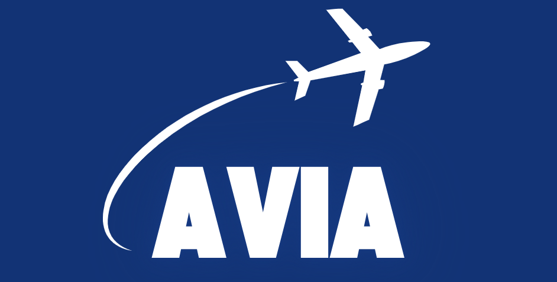
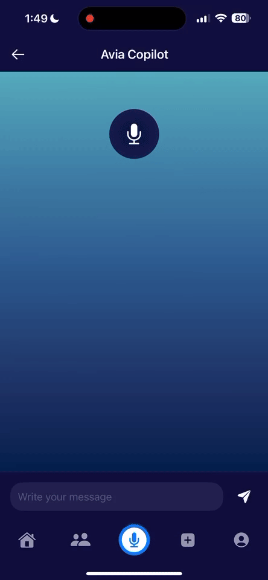

<p align="center">
  <picture>
    
  </picture>
</p>

## Website
[Click here visit our website](https://zoeyyyzheng.github.io/getavia.github.io/team.html)

Our poster is at `Avia__AI_Copilot_for_Enhanced_Pilot_Training___Safety.pdf`.

## Project Idea
Avia is an AI-powered voice assistant designed to revolutionize flight training.  
It provides:  
- Real-time voice-guided assistance.  
- Personalized learning tools.  
- Cost-effective training solutions.  

Our goal is to:  
- Make pilot training more efficient and accessible.  
- Help student pilots overcome challenges like multitasking under pressure.  
- Offer real-time guidance to enhance decision-making and safety.

## Sprint 4 Updates
### App development
- Finalized UI/UX design and Implemented our App with LLM and AWS.
- Generated flights data and trained Training LLM models.
### Demo
- Prepared for the final presentation and poster demos. 
### Next Step
- Real-time flight data collection.
- Continue develop our app, improve the LLM response quality and database constructions. 
- Demo the app with more people and collect feedback to improve it.

## App (NEW)
The current app version is in `App` folder. Clone this repository and open the code in App folders with Xcode to run the ios App. In order to use the LLM features, you need to replace the `api-key` in `AviaCopilotView.swift` with your own Openai keys.

If it has error in Xcode, the zip version of app is in `App/avia-app.zip`. Download the zip and open it with Xcode to see the current version of app. In order to view our current aws data scheme, visit [Amplify Studio with our schema](https://sandbox.amplifyapp.com/schema-design/7e242067-9577-4cf9-abdc-6bcf67840983) and follow the instructions to run the aws locally. If there are errors in aws packages, reference [this website](https://docs.amplify.aws/swift/start/quickstart/).  

We also include a demo here. 


## LLM Experiments
For this folder, it contains code used to train, test, and evaluate LLM's performance on our copilot task. 

### Training LLM Demo (NEW)
We provide website for holding our Training LLM demo. If you don't have access to Openai API key, you can directly try our speech to speech pipeline through the website.
You can visit [the website](https://huggingface.co/spaces/DPWXY15/Avia_flight_turn_copilot). 

### Emergency LLM Demo
We also provide website for holding our LLM demo. If you don't have access to Openai API key, you can directly try our speech to speech pipeline through the website.

You can visit [the website](https://huggingface.co/spaces/DPWXY15/Avia-demo). 
You can choose either give vioce input to simulate the flying situation or text input for testing model's output. The model's text output and voice output will be display on the website. You can also end conversation and start a new conversation. 

We also include a demo here. For display, we use text input. 


### Dataset Construction
We provide more data in `/LLM_experiment/data`, those data are better quality and aligned with pilot condition.

### Run Locally
To run our current LLM related models and experiments, go to `LLM_experiment` folder and run the set up code to install neccessary environment and paste your `your_openai_api_key` in the code to run the Openai api.
#### Set up
Before install PyAudio, install portaudio, especially for M2 Mac users.
```bash
brew install portaudio
```
Then
```bash
conda create --name avia python=3.10
conda activate avia
pip install -r LLM_experiment/requirements.txt
```

If you cannot install tiktoken using conda, try this:
```bash
conda install conda-forge::tiktoken
```
If there is error on any other package installation, try:
```bash
python -m pip install package_name
```

## Team Contribution
<table>
  <tr>
    <th>Team Member</th>
    <th>Sprint 1</th>
    <th>Sprint 2</th>
    <th>Sprint 3</th>
    <th>Sprint 4</th>
  </tr>
  <tr>
    <td><b>Rana Taki</b></td>
    <td>1. Designed and developed UI/UX for Avia mobile app.<br>2. Built the prototype.<br>3. Led initial testing.</td>
    <td>1. Refined UI/UX.<br>2. Led mobile app updates.<br>3. Implemented TSST.</td>
    <td>1. Architected Avia app UI/UX in Figma.<br>2. Developed functional Xcode prototype.<br>3. Tested in real flight scenario and enhanced UI based on feedback.<br>4. Reached out to Garmin engineers/vendors regarding Garmin API integration.</td>
    <td>1. Finalized the Avia mobile app UI/UX with enhanced emergency response features.<br>2. Implemented aircraft-specific control panels for different models.<br>3. Conducted comprehensive user acceptance testing with professional pilots.<br>4. Established formal partnership with Garmin for data integration protocols.</td>
  </tr>
  <tr>
    <td><b>Xiaoyue Wang</b></td>
    <td>1. Developed advanced LLM models for aviation.<br>2. Implemented speech-to-text and text-to-speech functionalities.</td>
    <td>1. Optimized LLM adaptability.<br>2. Improved speech-to-text pipeline.<br>3. Built an LLM demo website.</td>
    <td>1. Connected the pilots' profile data to AWS.<br>2. Improved aircraft adaptability to the most common and popular aircraft models in beginner pilots.<br>3. Fine-tuned models. Enhanced speech recognition for higher accuracy in-flight.</td>
    <td>1. Completed AWS backend optimization for secure, scalable deployment.<br>2. Improved AI model response time by 40% through optimized processing.<br>3. Created adaptive learning algorithms to personalize guidance based on pilot skill level.<br>4. Integrated real-time data into flight assistance parameters and tarind second LLM model.</td>
  </tr>
  <tr>
    <td><b>Yiguo Zheng (Zoey)</b></td>
    <td>1. Conducted market research.<br>2. Defined the problem statement.<br>3. Proposed solutions and built the website.</td>
    <td>1. Website refining and maintainance.<br>2. Led VC applications.<br>3. Built pilot communities.</td>
    <td>1. Reverted to getting data from the flight simulation using SimConnect API.<br>2. Market check in airport and flying club, research on product market fit and early adopters' willingness to pay.<br>3. VC application.</td>
    <td>1. Prepared comprehensive investor pitch deck for VC applications.<br>2. Expanded pilot testing community to five additional flight schools.<br>3. Developed go-to-market strategy with tiered pricing model.<br>4. Created analytics dashboard to measure pilot performance improvements and product effectiveness.</td>
  </tr>
</table>

# Previous Updates
## Sprint 3 Updates

### Core Achievements
- Implemented **intuitive UI with engaging user experience** - Refined mobile interface for pilot-friendly interactions
- Integrated **LLM for advanced conversational capabilities** - Enhanced AI assistant with aviation-specific knowledge
- Connected to **AWS for scalable cloud infrastructure** - Deployed robust backend for real-time data processing

### Technical Advancements
- Trained AI model with simulator data from **Microsoft Flight Simulator SimConnect API**
- Engineered adaptive system compatible with multiple aircraft models (**Cessna 172 & Challenger 350**)
- Addressed **voice interrupt challenges** and reduced latency in generation process
- Implemented comprehensive **flight parameter analysis** for real-time situational awareness

### User Experience & Testing
- Finalized **UI/UX design** for seamless pilot interaction during flight operations
- Created **social feed interface** for pilot community sharing and engagement
- Launched **pilot testing program** with Stanford Flying Club members
- Differentiated product from competitors (Goose AI) with advanced real-time assistance

### Partnership Progress
- Initiated discussions with **Garmin engineers** about accessing realtime data from aircraft
- Established framework for processing multiple flight conditions:
  - Real-time wind speeds, turbulence, and temperature variations
  - Pilot control inputs vs automated system responses
  - Flight dynamics across different aircraft models

### Next Steps
1. Complete AWS setup optimization (security, deployment, backend)
2. Expand pilot testing community and gather operational feedback
3. Enhance AI adaptability across additional aircraft models
4. Finalize Garmin data integration partnership for real-world testing

## Sprint 2 Updates  

### Prompt Engineering Improvements  
In **Sprint 2**, we focused on refining **prompt engineering** to enhance the voice assistant’s ability to handle **incomplete or unclear inputs** from pilots, particularly in **high-stress situations**. Key improvements include:  
- Better interpretation of **fragmented or disordered speech** to extract essential intent.  
- Enhanced robustness against **emergency-induced communication challenges**.  

### Bluetooth Connectivity & Noise Handling  
- Integrated **Bluetooth connectivity** for smoother real-time interactions.  
- Addressed prior **aircraft noise issues**, improving model response time in **high-noise environments**.  
- Optimized **speech recognition speed**, reducing the processing lag experienced in Sprint 1.  

### Website Update
- Build website for our project
- Build LLM demo website through HuggingFace Space

### Next Steps  
- Further enhance **mixed-language processing** (e.g., English + aviation terminology).  
- Improve **stability in extreme noise conditions**.  
- Optimize **real-time decision-making support** for pilots.  
